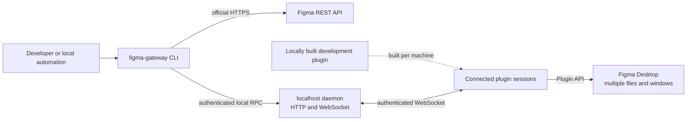

# Figma Gateway

Figma Gateway is a local developer tool that exposes the Figma REST API and Plugin API through a command-line interface and an optional MCP adapter.

This project is designed for local development and private automation. It is not a Figma Community plugin. Figma's review guidelines generally do not approve plugins that expose an MCP server or provide programmatic AI access to Figma files outside Figma's official MCP server.

## What it provides

- One `figma-gateway` CLI for local automation
- Direct access to official Figma REST `/v1` and `/v2` endpoints
- Plugin API access to the currently open Figma file through a localhost gateway
- Local gateway secret storage in macOS Keychain or Windows DPAPI
- OAuth, personal access token, and plan access token storage in macOS Keychain
- Concurrent connections to multiple Figma files and editor surfaces
- Structured node exports and image, PDF, and Motion exports
- An optional `figma-gateway-mcp` adapter for local MCP clients

Figma Gateway does not bypass Figma permissions, seats, plans, editor modes, API scopes, or rate limits.

## Distribution boundary

The repository and GitHub release package contain source code and the CLI/server runtime. They never contain a built plugin artifact.

`plugin/dist/` is always local-only. A local plugin build contains a credential derived from the current machine's Keychain and must not be uploaded, attached to a release, committed, or shared. Build the plugin separately on each machine that will run it.

Do not submit this plugin to Figma Community. Use Figma's official MCP server for public MCP integrations. If a standalone Community plugin is developed later, it must not connect to this gateway, expose MCP functionality, or execute arbitrary commands received from an external process.

## API boundaries

| Path | Scope | Best suited for |
|---|---|---|
| Plugin API | The file where the local development plugin is running | Node creation and editing, selection, viewport, variables, and `exportAsync` |
| REST API | Files, folders, teams, and organizations accessible to the configured token | Comments, versions, metadata, webhooks, inventories, and audits |

The Plugin API cannot read comments, folders, saved versions, webhooks, or activity logs. The standard REST API cannot edit the canvas. Figma Gateway exposes both paths without treating them as interchangeable.

## Architecture



The daemon routes requests by session key, file metadata, `editorType`, and `editorMode`. REST credentials are isolated by `--profile`. Plugin sessions always use the shared local gateway instance.

## Requirements

- Node.js 20 or later when installing from source
- macOS 13 or later, or Windows 10/11 on x64 or ARM64
- Figma Desktop for Plugin API operations
- Accessibility permission on macOS when using automatic Plugin launch

## Install on macOS with Homebrew

```bash
brew tap arcmanagement/figma-gateway https://github.com/arcmanagement/figma-gateway.git
brew trust --cask arcmanagement/figma-gateway/figma-gateway
brew install --cask arcmanagement/figma-gateway/figma-gateway
```

The public Figma Gateway repository is also the Homebrew tap; no separate tap
repository is required. The Cask installs an ArcManagement Inc. Developer ID
signed and Apple-notarized background application and both CLI entrypoints.
Installation generates the per-machine Plugin and registers the daemon as a
login service. Homebrew prints both manifest paths to import into Figma once.

The legacy Formula remains available for compatibility. It requires
`figma-gateway setup` after installation and does not provide the Developer ID
signed distribution:

```bash
brew trust --formula arcmanagement/figma-gateway/figma-gateway
brew install --formula arcmanagement/figma-gateway/figma-gateway
figma-gateway setup
```

## Install on Windows

Download the x64 or ARM64 installer for your machine from
[GitHub Releases](https://github.com/arcmanagement/figma-gateway/releases/latest)
and run it. WinGet distribution is not provided. The installers are not
code-signed, so Windows may show an unknown-publisher warning.

The installer generates the per-machine Plugin and registers a per-user login
task with automatic restart. Import both
`%LOCALAPPDATA%\FigmaGateway\plugin\manifest.json` and
`%LOCALAPPDATA%\FigmaGateway\plugin\dev\manifest.json` into Figma once. Both x64
and ARM64 installers are published. Each installer includes the matching
Node.js runtime and its license, so a separate Node.js installation is not
required.

## Install from source

```bash
npm install
npm run check
npm test
python3 -m unittest discover -s tests -p 'test_*.py'
```

Build and link the CLI, then perform local setup. The gateway secret is stored
in Keychain on macOS or protected with current-user DPAPI on Windows. Its value
is never printed.

```bash
npm run build
npm link
figma-gateway setup
```

## Managed daemon

`setup` generates the local Plugin and installs the daemon. The daemon uses a
LaunchAgent on macOS and a per-user scheduled task on Windows. A supervisor
checks authenticated health and restarts an unhealthy worker.

```bash
figma-gateway daemon install
figma-gateway daemon status
```

The service definition stores only the credential service name. It does not
contain the secret value.

```bash
figma-gateway daemon restart
figma-gateway daemon stop
figma-gateway daemon start
figma-gateway daemon uninstall --confirm
```

## Build and register the local plugins

Figma Gateway has one product identity, runtime, daemon, and CLI. Its local
build emits two registrations because Figma does not allow `figjam` and `dev`
in the same manifest:

- `manifest.json`: Figma Design, FigJam, Slides, Buzz, Motion, and text review
- `dev/manifest.json`: Dev Mode inspect, Codegen, and Figma for VS Code

Both registrations connect to the same `shared` gateway instance. The manifests
enable every public permission and capability that Figma exposes to local
development plugins, plus proposed and private-plugin APIs. Figma partner-only
APIs, account permissions, plan restrictions, and each editor's read/write
rules still apply.

Generate or refresh the per-machine Plugin:

```bash
figma-gateway plugin build
```

The command returns both manifest paths under the current user's application
data directory. In Figma Desktop, choose Plugins > Development > Import plugin
from manifest..., then select each file. This is a one-time manual registration.
Run Plugins > Development > Figma Gateway in each file that should connect.

Automatic Plugin startup and Figma window control are macOS-only. On Windows,
start the development Plugin from Figma's menu; the gateway daemon itself is
already resident.

## CLI examples

```bash
figma-gateway status
figma-gateway plugin start --url 'https://www.figma.com/design/FILE_KEY/FILE_NAME'
figma-gateway plugin start --url 'https://www.figma.com/design/FILE_KEY/FILE_NAME' --mode dev
figma-gateway plugin start --url 'https://www.figma.com/design/FILE_KEY/FILE_NAME' --mode motion
figma-gateway plugin start --url 'https://www.figma.com/board/FILE_KEY/FILE_NAME' --mode figjam
figma-gateway plugin start --url 'https://www.figma.com/slides/FILE_KEY/FILE_NAME' --mode slides
figma-gateway plugin windows
figma-gateway plugin files
```

Select a connected session before using the Plugin API:

```bash
figma-gateway plugin node SESSION_KEY 2429:67732 --depth 1

# Search the generated one-to-one command catalog and inspect exact parameters.
figma-gateway plugin api list --search variable
figma-gateway plugin api describe figma.variables.create-variable

# Every root API and namespace API has its own command ID and named parameters.
figma-gateway plugin api figma.editor-type SESSION_KEY
figma-gateway plugin api figma.get-node-by-id-async SESSION_KEY \
  --params '{"id":"2429:67732"}' --confirm
figma-gateway plugin api figma.variables.create-variable SESSION_KEY \
  --params '{"name":"Spacing","collectionId":"VariableCollectionId:1:2","resolvedType":"FLOAT"}' \
  --confirm

# Live Plugin objects are explicit values; no JavaScript is evaluated.
figma-gateway plugin api figma.group SESSION_KEY \
  --params '{"nodes":[{"$node":"1:2"},{"$node":"1:3"}],"parent":{"$figma":"currentPage"}}' \
  --confirm

# Returned host objects include a session-scoped $handle. Use the command for
# that exact interface to read, call, or write its members.
figma-gateway plugin api figma.current-page SESSION_KEY
figma-gateway plugin api page-node.selection SESSION_KEY \
  --target '{"$handle":"h1"}' --value '[{"$node":"1:2"}]' --confirm
figma-gateway plugin api layout-mixin.resize SESSION_KEY \
  --target '{"$node":"1:2"}' --params '{"width":320,"height":240}' --confirm

# Event and predicate APIs accept code-free persistent callbacks.
figma-gateway plugin callback create SESSION_KEY --return '[]'
figma-gateway plugin api figma.codegen.on SESSION_KEY \
  --params '{"type":"generate","callback":{"$handle":"h2"}}' --overload 1 --confirm
figma-gateway plugin callback events SESSION_KEY h2

# Arbitrary execution remains available as an explicit escape hatch, but the
# generated Plugin API commands above do not depend on it.
figma-gateway plugin exec SESSION_KEY \
  --code 'return { page: figma.currentPage.name, selection: figma.currentPage.selection.map(node => node.id) }' \
  --confirm

figma-gateway plugin export SESSION_KEY 2429:67732 out/screen.png \
  --format PNG --scale 2

figma-gateway plugin export SESSION_KEY 2429:67732 out/animation.mp4 \
  --format MP4 --scale 1 --fps 30 --quality HIGH
```

The command catalog is generated from the pinned official
`@figma/plugin-typings` package. It currently contains 1,231 unique commands
covering all 1,268 method, property, overload, index, and documented global
declarations across 252 interfaces plus `__html__` and `__uiFiles__`.
`npm run verify:plugin-api` fails when the typings and the
committed catalog differ, and the test suite independently proves that every
declaration is represented.

Plugin API method calls and writes, arbitrary plugin code, and non-GET REST
requests require explicit confirmation. Named `--params` are ordered according
to the selected official overload; use `--overload N` when overload parameter
names overlap. Values support `{"$handle":"HANDLE"}` for live objects and
callbacks, `{"$node":"NODE_ID"}`, `{"$figma":"PATH"}`, and
`{"$base64":"ENCODED_BYTES"}`. Handles belong to one running Plugin session
and expire when that session ends. Dev Mode remains read-only for document
contents because Figma enforces that boundary.

## Logs and telemetry

Figma Gateway sends no telemetry. Its local JSONL audit log records only the
operation name, success or failure, duration, and timestamp. It never records
Figma file names, node contents, executed code, request arguments, credentials,
or customer data. Logs rotate locally after 5 MiB.

## Multiple files

Open each target file in a separate Figma Desktop window and run the development plugin in each window. Use the session key returned by `plugin files` to route a request to the intended file.

```bash
figma-gateway plugin focus 'Design System'

figma-gateway plugin exec-many SESSION_A SESSION_B \
  --code 'return { file: figma.root.name, page: figma.currentPage.name }' \
  --confirm
```

## REST authentication

Use a named profile only for REST credentials. Profiles do not select a Figma Desktop account or plugin session.

```bash
figma-gateway --profile example auth store pat
figma-gateway --profile example auth status pat
figma-gateway --profile example rest GET /v1/me
```

On macOS, OAuth credentials may include a refresh token, client ID, and client
secret in Keychain. Figma Gateway refreshes an expiring OAuth access token
through the official `POST /v1/oauth/token` endpoint when all required refresh
credentials are available. On Windows, provide `FIGMA_ACCESS_TOKEN` in the
calling process; persistent REST credential commands are macOS-only.

Environment variables override Keychain credentials for the current process:

```bash
export FIGMA_TOKEN_KIND=oauth
export FIGMA_TOKEN_KEYCHAIN_ITEM=figma_token_example_oauth
```

Call any supported REST endpoint:

```bash
figma-gateway rest GET /v1/files/FILE_KEY/comments \
  --query '{"as_md":true}'

figma-gateway rest POST /v1/files/FILE_KEY/comments \
  --body '{"message":"Reviewed"}' \
  --confirm
```

Large responses can be saved under the caller's working directory with `--save`. REST paths are restricted to `/v1` and `/v2` on `https://api.figma.com`.

## Optional MCP adapter

`figma-gateway-mcp` exposes the same local gateway to MCP clients that cannot call the CLI directly. It is intended for local development only and is not distributed through a Figma Community plugin.

| Tool | Purpose |
|---|---|
| `list_files` | List connected Figma files |
| `get_node` | Serialize a node recursively |
| `save_screenshots` | Export PNG, JPG, SVG, PDF, MP4, GIF, or WebM files |
| `execute_plugin_code` | Execute explicitly confirmed JavaScript against the local Plugin API session |
| `plugin_api_list` | List exact command IDs generated from the pinned official typings |
| `plugin_api_describe` | Show one command's interface, types, and overload parameters |
| `plugin_api_invoke` | Invoke a cataloged API command without evaluating JavaScript |
| `plugin_callback_create` | Create a code-free callback with a fixed JSON return value |
| `plugin_callback_events` | Read and optionally retain the callback's recorded calls |
| `plugin_api_get`, `plugin_api_call`, `plugin_api_set`, `plugin_api_callback` | Legacy raw-path compatibility tools |
| `figma_rest_request` | Call an official REST `/v1` or `/v2` endpoint |
| `figma_auth_status` | Report credential configuration without exposing values |
| `get_comments` | Retrieve file comments and optionally select one comment |
| `get_file_meta` | Retrieve file metadata without loading the document tree |
| `get_file_versions` | Retrieve saved version history |

Direct stdio access is available through the helper script:

```bash
bash -c 'source scripts/common.sh; python3 scripts/bridge-call.py list_files "{}"'
```

## Export structures and images

The export helper opens a Figma URL, starts the local development plugin, retrieves the requested node, writes the result, and restores the previous application state.

```bash
./scripts/export.sh '<FIGMA_URL>' --scale 2 --format PNG --out ./out
./scripts/export.sh '<FIGMA_URL>' --tree --out ./out
./scripts/export.sh '<SECTION_OR_FRAME_URL>' --structure --out ./out
```

`--structure` writes the root, descendant sections, and outermost frames as separate images, plus `structure.json` and `manifest.json`. FigJam and Slides are supported. Output paths are restricted to the caller's working directory.

The REST-only fallback is intended for a small number of nodes when Figma Desktop is unavailable:

```bash
./scripts/export-rest.sh '<FIGMA_URL>' --scale 2 --format png --out ./out
```

REST image exports are subject to Figma's 32-megapixel limit and REST rate limits. Use local Plugin API exports for high-resolution implementation assets.

## Verification

```bash
npm run check
npm test
python3 -m unittest discover -s tests -p 'test_*.py'
bash -c 'source scripts/common.sh; npm run build'
archive="$(npm pack --json | node -e 'let s="";process.stdin.on("data",d=>s+=d).on("end",()=>console.log(JSON.parse(s)[0].filename))')"
RELEASE_PROHIBITED_TERMS='private-term-1,private-term-2' npm run verify:release -- "$archive"
```

The tests cover multi-session routing, authenticated local RPC, plugin request/response handling, output path confinement, OAuth/PAT/plan headers, REST write confirmation, local plugin identity, and release package boundaries.

## Releases

GitHub releases contain the CLI/server package and source required for local plugin builds. They do not contain `plugin/dist`, local configuration, test fixtures, screenshots, or credentials.

A release tag must match `package.json` and point to a commit contained in `main`. The release workflow verifies the source, builds the server, checks the package allowlist, and scans the packed archive before creating a release.

Uninstalling the managed daemon removes its service definition but keeps the
per-machine Plugin, protected gateway secret, and metadata-only audit log so a
later reinstall can reuse them. Remove those user-data directories and the
credential manually only when permanent local revocation is intended.

Maintainer publication steps, including clean-history creation, updating the
repository's Homebrew Formula, and publishing the Windows installers, are
documented in `docs/RELEASE.md`.

## Official documentation

- [Figma REST authentication](https://developers.figma.com/docs/rest-api/authentication/)
- [Figma REST scopes](https://developers.figma.com/docs/rest-api/scopes/)
- [Figma REST rate limits](https://developers.figma.com/docs/rest-api/rate-limits/)
- [Figma REST OpenAPI specification](https://github.com/figma/rest-api-spec)
- [Figma Plugin API](https://developers.figma.com/docs/plugins/api/api-reference/)
- [Figma plugin manifest](https://developers.figma.com/docs/plugins/manifest/)
- [Figma plugin review guidelines](https://help.figma.com/hc/en-us/articles/360039958914-Plugin-and-widget-review-guidelines)
- [Figma MCP server](https://help.figma.com/hc/en-us/articles/32132100833559-Guide-to-the-Figma-MCP-server)
